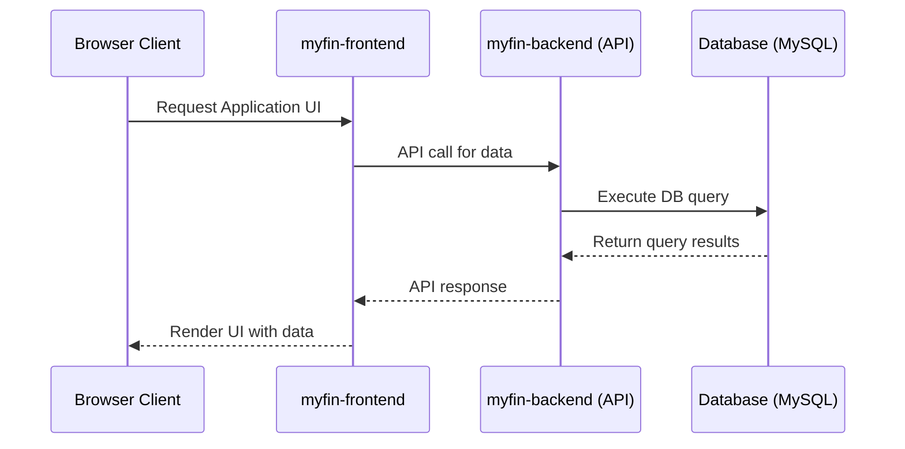
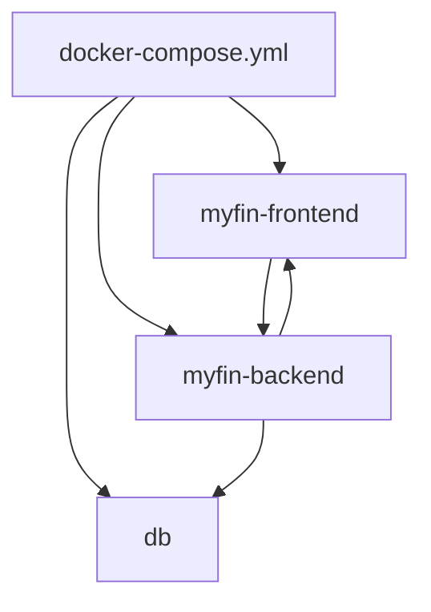

# Application Architecture

## Overview

The `myfin` application is composed of multiple services orchestrated via Docker Compose. The key components include:

- **myfin-frontend:** Serves the user interface.
- **myfin-backend:** Exposes API endpoints and handles business logic.
- **db:** Provides persistent data storage (configured with MySQL).

## Sequence Diagram

## Flow Diagram

## Docker Compose Configuration

The project's `docker-compose.yml` file not only defines the services but also sets environment variables for configuration (e.g., database and application settings). Refer to the Docker Compose file for detailed configurations.

---

This documentation provides a clear overview of the system's components and their interactions, helping both current and future developers to understand the architecture of the myfin application.
